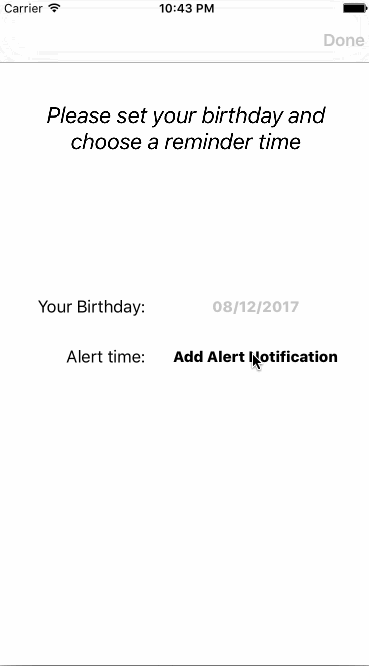

# Birthday

A small demo that can set a birthday and will receive a local notification at the specified time.

## Development environment

* Xcode version：8.3.3  
* iOS：9.0+   
* Programming Language: Swift 3
	
## Dependiencies

* Cocoapods
* SnapKit

## Setup

* Terminal command:

		1. git clone git@github.com:theteam247/Birthday.git
		2. cd birthday
		3. Pod install
	
* open "RainbowList.xcworkspace" in Finder.
* build and run.

## screenshot
